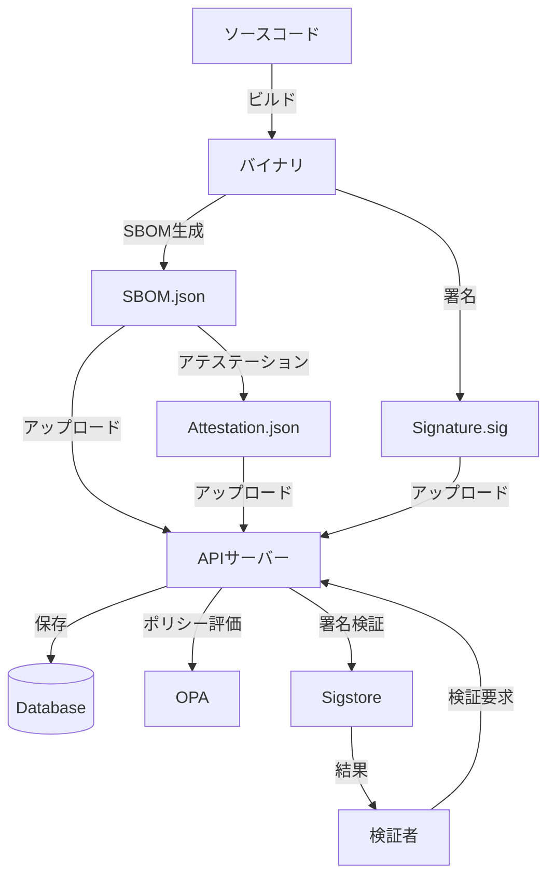

# Provenix プロジェクト全体像

最終更新: 2025 年 11 月 18 日

## 📋 目次

1. [プロジェクト概要](#プロジェクト概要)
2. [アーキテクチャ](#アーキテクチャ)
3. [主要コンポーネント](#主要コンポーネント)
4. [技術スタック](#技術スタック)
5. [機能一覧](#機能一覧)
6. [データフロー](#データフロー)
7. [セキュリティモデル](#セキュリティモデル)
8. [開発ガイド](#開発ガイド)

---

## プロジェクト概要

### 🎯 目的

Provenix は、**ゼロトラスト・ソフトウェアサプライチェーンセキュリティプラットフォーム**です。
ソフトウェア開発から本番環境までの全プロセスにおいて、暗号学的な検証と追跡可能性を提供します。

### 🌟 主要機能

| 機能                   | 説明                                | 実装状態      |
| ---------------------- | ----------------------------------- | ------------- |
| **SBOM 生成**          | ソフトウェア部品表の自動生成        | ✅ 基盤実装済 |
| **デジタル署名**       | 暗号学的な成果物署名                | ✅ 基盤実装済 |
| **アテステーション**   | ビルドプロセスの証明                | ✅ 基盤実装済 |
| **検証**               | 署名とアテステーションの検証        | ✅ 基盤実装済 |
| **API サーバー**       | エンタープライズグレードの REST API | ✅ 実装済     |
| **CLI**                | 統合コマンドラインインターフェース  | ✅ 実装済     |
| **Web フロントエンド** | React/TypeScript ベースの UI        | 🚧 開発中     |

### 📊 プロジェクトステータス

- **フェーズ**: アーキテクチャ再構築中（`restructure/provenix-crates`ブランチ）
- **バージョン**: 0.1.0
- **ビルド状態**: ✅ 全ワークスペースビルド成功
- **テスト**: ✅ コアレジストリテスト通過

---

## アーキテクチャ

### 🏗️ 全体構成

```
┌─────────────────────────────────────────────────────────────────┐
│                         Provenix Platform                       │
├─────────────────────────────────────────────────────────────────┤
│                                                                 │
│  ┌──────────────┐  ┌──────────────┐  ┌──────────────┐         │
│  │   CLI (px)   │  │  Web UI      │  │  API Clients │         │
│  │   provenix   │  │  (React)     │  │              │         │
│  └──────┬───────┘  └──────┬───────┘  └──────┬───────┘         │
│         │                 │                 │                   │
│         └─────────────────┴─────────────────┘                   │
│                           │                                     │
│         ┌─────────────────┴──────────────────┐                 │
│         │                                    │                 │
│  ┌──────▼──────┐                   ┌────────▼────────┐         │
│  │   Server    │◄──────────────────┤  Registry Core  │         │
│  │   (pxs)     │                   │  (プラグイン)   │         │
│  └──────┬──────┘                   └────────┬────────┘         │
│         │                                   │                   │
│  ┌──────┴──────────────────────────────────┴──────┐            │
│  │            Provider Implementations            │            │
│  ├────────────┬──────────┬─────────┬──────────────┤            │
│  │  SBOM      │  Attest  │  Sign   │  Verify      │            │
│  │  (Syft)    │(In-Toto) │(Cosign) │(Sigstore)    │            │
│  └────────────┴──────────┴─────────┴──────────────┘            │
│                                                                 │
└─────────────────────────────────────────────────────────────────┘
```

### 🗂️ ディレクトリ構造

```
provenix/
├── Cargo.toml                  # ワークスペース定義
├── README.md                   # プロジェクト説明
│
├── crates/                     # Rustクレート群
│   ├── provenix-cli/          # メインCLI (px/provenix)
│   ├── provenix-core/         # コアライブラリ
│   ├── provenix-plugin/       # プラグインインターフェース
│   ├── provenix-sbom/         # SBOM生成 (pxb)
│   ├── provenix-attest/       # アテステーション (pxa)
│   ├── provenix-sign/         # 署名機能
│   ├── provenix-verify/       # 検証機能
│   └── provenix-utils/        # ユーティリティ
│
├── server/                     # APIサーバー (pxs)
│   ├── src/
│   │   ├── main.rs            # エントリーポイント
│   │   ├── auth/              # 認証・認可
│   │   ├── policy/            # ポリシーエンジン (OPA)
│   │   ├── routes/            # APIエンドポイント
│   │   ├── services/          # ビジネスロジック
│   │   └── storage/           # データ永続化
│   ├── config/                # 設定ファイル
│   └── migrations/            # DBマイグレーション
│
├── frontend/                   # Webフロントエンド
│   ├── src/
│   └── public/
│
├── infra/                      # インフラストラクチャ
│   ├── docker/                # Dockerfiles & Compose
│   └── terraform/             # IaCスクリプト
│
├── scripts/                    # 自動化スクリプト
│   ├── build.sh
│   ├── test.sh
│   └── release.sh
│
├── tests/                      # テストスイート
│   ├── api/
│   ├── cli/
│   └── e2e/
│
└── docs/                       # ドキュメント
    ├── PROJECT_OVERVIEW.md    # このファイル
    ├── architecture.md
    ├── SECURITY_MODEL.md
    ├── DEPLOYMENT_GUIDE.md
    └── api.md
```

---

## 主要コンポーネント

### 1. 🎯 provenix-core

**役割**: システム全体の中核となるライブラリ

**主要機能**:

- **レジストリシステム**: プロバイダーの動的登録・取得
- **パイプライン**: ワークフロー実行の調整
- **設定管理**: アプリケーション設定の読み込み・保存
- **エラーハンドリング**: 統一されたエラー型

**主要 API**:

```rust
// プロバイダー登録
register_sbom(name, provider) -> Result<()>
register_attest(name, provider) -> Result<()>
register_sign(name, provider) -> Result<()>
register_verify(name, provider) -> Result<()>

// プロバイダー取得
get_sbom(name) -> Result<Arc<dyn SbomProvider>>
get_attest(name) -> Result<Arc<dyn AttestProvider>>
get_sign(name) -> Result<Arc<dyn SignProvider>>
get_verify(name) -> Result<Arc<dyn VerifyProvider>>

// ユーティリティ
list_sbom_providers() -> Result<Vec<String>>
has_sbom_provider(name) -> Result<bool>
```

**特徴**:

- ✅ スレッドセーフ（`RwLock` + `Arc`）
- ✅ エラーハンドリング（`Result`型）
- ✅ 重複登録チェック
- ✅ 効率的なクローン（参照カウント）

---

### 2. 🔌 provenix-plugin

**役割**: プラグインインターフェース定義

**トレイト定義**:

```rust
// SBOM生成プロバイダー
pub trait SbomProvider: Send + Sync {
    fn name(&self) -> &str;
    fn generate(&self, target: &str, output: &PathBuf) -> PluginResult;
}

// アテステーションプロバイダー
pub trait AttestProvider: Send + Sync {
    fn name(&self) -> &str;
    fn attest(&self, sbom: &PathBuf, metadata: &Value, out: &PathBuf) -> PluginResult;
}

// 署名プロバイダー
pub trait SignProvider: Send + Sync {
    fn name(&self) -> &str;
    fn sign(&self, artifact: &PathBuf, key: &str, out: &PathBuf) -> PluginResult;
}

// 検証プロバイダー
pub trait VerifyProvider: Send + Sync {
    fn name(&self) -> &str;
    fn verify(&self, artifact: &PathBuf, signature: &PathBuf, rekor_url: Option<&str>) -> PluginResult;
}
```

**型エイリアス**:

```rust
pub type PluginResult = Result<Value>; // JSON互換の結果
```

---

### 3. 📦 provenix-sbom

**役割**: SBOM（Software Bill of Materials）生成

**実装プロバイダー**:

- ✅ **SyftProvider**: Syft を使用した SBOM 生成

**バイナリ**: `pxb` (Provenix BOM)

**使用例**:

```rust
let provider = get_sbom("syft")?;
let output = PathBuf::from("sbom.json");
provider.generate("./target", &output)?;
```

**自動登録**:

```rust
#[ctor::ctor]
fn register() {
    let _ = provenix_core::registry::register_sbom("syft", SyftProvider);
}
```

---

### 4. 📝 provenix-attest

**役割**: ビルドアテステーション（証明）の作成

**実装プロバイダー**:

- ✅ **InTotoProvider**: In-Toto 形式のアテステーション

**バイナリ**: `pxa` (Provenix Attest)

**使用例**:

```rust
let provider = get_attest("in-toto")?;
let sbom_path = PathBuf::from("sbom.json");
let output = PathBuf::from("attestation.json");
let metadata = json!({});
provider.attest(&sbom_path, &metadata, &output)?;
```

---

### 5. ✍️ provenix-sign

**役割**: 成果物のデジタル署名

**実装プロバイダー**:

- ✅ **CosignProvider**: Cosign を使用した署名

**使用例**:

```rust
let provider = get_sign("cosign")?;
let artifact = PathBuf::from("binary");
let output = PathBuf::from("signature.sig");
provider.sign(&artifact, "key.pem", &output)?;
```

---

### 6. ✅ provenix-verify

**役割**: 署名とアテステーションの検証

**実装プロバイダー**:

- ✅ **SigstoreProvider**: Sigstore を使用した検証

**使用例**:

```rust
let provider = get_verify("sigstore")?;
let artifact = PathBuf::from("binary");
let signature = PathBuf::from("signature.sig");
let result = provider.verify(&artifact, &signature, None)?;

if result.get("valid").and_then(|v| v.as_bool()).unwrap_or(false) {
    println!("検証成功");
}
```

---

### 7. 🖥️ provenix-cli

**役割**: 統合コマンドラインインターフェース

**バイナリ**: `provenix-cli` (エイリアス: `px`, `provenix`)

**サブコマンド**:

| コマンド  | 説明                 | 実装状態  |
| --------- | -------------------- | --------- |
| `run`     | 全パイプライン実行   | ✅ 実装済 |
| `sbom`    | SBOM 生成            | ✅ 実装済 |
| `attest`  | アテステーション作成 | ✅ 実装済 |
| `sign`    | 署名                 | ✅ 実装済 |
| `verify`  | 検証                 | ✅ 実装済 |
| `publish` | レジストリ公開       | 🚧 TODO   |

**モジュール構成**:

```
provenix-cli/
├── main.rs              # エントリーポイント
├── config.rs            # 設定管理
└── executor/            # 実行ロジック
    ├── mod.rs
    ├── pipeline.rs      # パイプライン調整
    ├── sbom.rs          # SBOM生成
    ├── attest.rs        # アテステーション
    ├── sign.rs          # 署名
    ├── verify.rs        # 検証
    └── publish.rs       # 公開
```

**使用例**:

```bash
# 全パイプライン実行
provenix-cli run

# SBOM生成
provenix-cli sbom

# アテステーション作成
provenix-cli attest

# 署名
provenix-cli sign

# 検証
provenix-cli verify
```

---

### 8. 🌐 server (pxs)

**役割**: エンタープライズグレードの API サーバー

**バイナリ**: `pxs` (Provenix Server)

**主要モジュール**:

#### 🔐 auth/ (認証・認可)

- **OIDC 統合**: OpenID Connect 認証
- **JWT 検証**: トークンベース認証
- **ロール管理**: RBAC 実装

```rust
pub struct AuthState {
    pub jwt_secret: String,
    pub oidc_config: OidcConfig,
}

pub struct Claims {
    pub sub: String,
    pub exp: usize,
    pub roles: Vec<String>,
    pub permissions: Vec<String>,
}
```

#### 📋 policy/ (ポリシーエンジン)

- **OPA 統合**: Open Policy Agent
- **動的認可**: コンテキストベースのアクセス制御

```rust
pub struct PolicyRequest {
    pub subject: String,
    pub action: String,
    pub resource: String,
    pub context: Value,
}
```

#### 🛣️ routes/ (API エンドポイント)

- **SBOM 管理**: アップロード、取得、リスト
- **アテステーション**: 作成、検証
- **ヘルスチェック**: システム状態監視

**エンドポイント**:

```
GET  /health                    # ヘルスチェック
GET  /api/v1                    # API情報
POST /api/v1/auth/login        # ログイン
GET  /api/v1/auth/verify       # トークン検証
POST /api/v1/sbom/             # SBOM作成
GET  /api/v1/sbom/             # SBOMリスト
GET  /api/v1/sbom/:id          # SBOM取得
POST /api/v1/attest/           # アテステーション作成
POST /api/v1/attest/verify     # アテステーション検証
```

#### 💾 storage/ (データ永続化)

- **データベース管理**: PostgreSQL (SQLx)
- **レコード定義**: SBOM、アテステーション

```rust
pub struct DatabaseManager {
    pool: PgPool,
}

pub struct SbomRecord {
    pub id: Uuid,
    pub project: String,
    pub version: String,
    pub data: Value,
    pub hash: String,
    pub created_at: DateTime<Utc>,
}

pub struct AttestationRecord {
    pub id: Uuid,
    pub subject_id: Uuid,
    pub signature: String,
    pub timestamp: DateTime<Utc>,
}
```

#### 🎯 services/ (ビジネスロジック)

- **SbomService**: SBOM 管理ロジック
- **AttestationService**: アテステーション管理

---

### 9. 🛠️ provenix-utils

**役割**: 共通ユーティリティ

**提供機能**:

- ロギング設定
- エラーハンドリングヘルパー
- 設定ファイル読み込み
- 共通型定義

---

## 技術スタック

### 🦀 バックエンド

| 技術          | 用途                   | バージョン   |
| ------------- | ---------------------- | ------------ |
| **Rust**      | 主要プログラミング言語 | 2021 Edition |
| **Axum**      | Web フレームワーク     | 0.7          |
| **SQLx**      | データベースドライバ   | 0.7          |
| **Tokio**     | 非同期ランタイム       | 1.0          |
| **Clap**      | CLI パーサー           | 4.0          |
| **Serde**     | シリアライゼーション   | 1.0          |
| **Anyhow**    | エラーハンドリング     | 1.0          |
| **Thiserror** | カスタムエラー定義     | 1.0          |

### 🌐 フロントエンド

| 技術           | 用途              | 状態 |
| -------------- | ----------------- | ---- |
| **React**      | UI フレームワーク | 🚧   |
| **TypeScript** | 型安全性          | 🚧   |
| **Vite**       | ビルドツール      | 🚧   |

### 🗄️ データベース

| 技術           | 用途               |
| -------------- | ------------------ |
| **PostgreSQL** | メインデータベース |

### 🔒 セキュリティ

| 技術        | 用途             |
| ----------- | ---------------- |
| **JWT**     | 認証トークン     |
| **OIDC**    | 認証プロトコル   |
| **OPA**     | ポリシーエンジン |
| **TLS 1.3** | 暗号化通信       |

### 🔧 ツール

| ツール       | 用途             |
| ------------ | ---------------- |
| **Syft**     | SBOM 生成        |
| **Cosign**   | 署名             |
| **Sigstore** | 検証             |
| **In-Toto**  | アテステーション |

---

## 機能一覧

### ✅ 実装済み機能

#### コアシステム

- [x] プラグインレジストリシステム
- [x] プロバイダーインターフェース定義
- [x] エラーハンドリングフレームワーク
- [x] 設定管理システム
- [x] パイプライン実行エンジン

#### SBOM 機能

- [x] Syft プロバイダー統合
- [x] SBOM 生成 API
- [x] SBOM 保存・取得

#### アテステーション機能

- [x] In-Toto プロバイダー統合
- [x] アテステーション作成 API
- [x] アテステーション検証

#### 署名・検証機能

- [x] Cosign 署名プロバイダー
- [x] Sigstore 検証プロバイダー
- [x] 署名作成・検証 API

#### API サーバー

- [x] REST API エンドポイント
- [x] 認証・認可基盤
- [x] ポリシーエンジン統合
- [x] データベース統合
- [x] ヘルスチェック

#### CLI

- [x] 統合 CLI インターフェース
- [x] サブコマンド実装
- [x] 設定ファイルサポート
- [x] エグゼキューターモジュール

### 🚧 開発中機能

- [ ] Web フロントエンド
- [ ] レジストリ公開機能
- [ ] 脆弱性スキャン
- [ ] レポート生成
- [ ] ダッシュボード

### 📋 計画中機能

- [ ] マルチテナント対応
- [ ] Webhook 統合
- [ ] CI/CD プラグイン
- [ ] SLSA レベル対応
- [ ] Rekor 透明性ログ統合

---

## データフロー

### 🔄 典型的なワークフロー



### 📊 コンポーネント間通信

```
┌─────────────┐
│     CLI     │
└──────┬──────┘
       │ (関数呼び出し)
       ▼
┌─────────────┐
│  Registry   │
└──────┬──────┘
       │ (Arc<Provider>)
       ▼
┌─────────────┐
│  Providers  │
│  - SBOM     │
│  - Attest   │
│  - Sign     │
│  - Verify   │
└──────┬──────┘
       │ (外部コマンド実行)
       ▼
┌─────────────┐
│ External    │
│ Tools       │
│ - Syft      │
│ - Cosign    │
│ - etc.      │
└─────────────┘
```

---

## セキュリティモデル

### 🔐 ゼロトラスト原則

1. **検証なしに信頼しない**

   - すべてのリクエストで認証・認可
   - 短命なトークン使用

2. **最小権限の原則**

   - 必要最小限のアクセス権限
   - ロールベースアクセス制御

3. **侵害を前提とした設計**
   - 多層防御
   - 異常検知と監査ログ

### 🛡️ セキュリティ機能

#### 認証

- ✅ OIDC 統合
- ✅ JWT 検証
- 🚧 MFA 対応

#### 認可

- ✅ ポリシーベース（OPA）
- ✅ コンテキスト考慮
- ✅ 動的評価

#### データ保護

- ✅ TLS 1.3 通信
- ✅ データベース暗号化
- 🚧 フィールドレベル暗号化

#### 監査

- ✅ 構造化ログ
- ✅ 不変監査証跡
- 🚧 リアルタイム監視

---

## 開発ガイド

### 🚀 クイックスタート

```bash
# リポジトリクローン
git clone https://github.com/hoso8722/provenix.git
cd provenix

# ビルド
cargo build --workspace

# テスト
cargo test --workspace

# 実行
cargo run -p provenix-cli
cargo run -p provenix-server
```

### 📦 ビルドコマンド

```bash
# 開発ビルド
cargo build --workspace

# リリースビルド
cargo build --workspace --release

# 特定のクレートのみ
cargo build -p provenix-core
cargo build -p provenix-cli

# 警告を含めてビルド
cargo build --workspace 2>&1 | less
```

### 🧪 テストコマンド

```bash
# 全テスト実行
cargo test --workspace

# ライブラリテストのみ
cargo test --workspace --lib

# 特定のクレート
cargo test -p provenix-core

# 詳細出力
cargo test --workspace -- --nocapture
```

### 🔧 開発ツール

```bash
# フォーマット
cargo fmt --all

# Lint
cargo clippy --workspace

# 依存関係チェック
cargo tree

# セキュリティ監査
cargo audit

# ドキュメント生成
cargo doc --workspace --open
```

### 📝 新しいプロバイダーの追加

1. **トレイト実装**

```rust
use provenix_plugin::SbomProvider;

pub struct MyProvider;

impl SbomProvider for MyProvider {
    fn name(&self) -> &str {
        "my-provider"
    }

    fn generate(&self, target: &str, output: &PathBuf) -> PluginResult {
        // 実装
        Ok(json!({"status": "success"}))
    }
}
```

2. **自動登録**

```rust
#[ctor::ctor]
fn register() {
    let _ = provenix_core::registry::register_sbom("my-provider", MyProvider);
}
```

3. **Cargo.toml に依存追加**

```toml
[dependencies]
provenix-core = { path = "../provenix-core" }
provenix-plugin = { path = "../provenix-plugin" }
ctor = "0.2"
```

### 🐛 デバッグ

```bash
# ログレベル設定
RUST_LOG=debug cargo run -p provenix-cli

# バックトレース有効化
RUST_BACKTRACE=1 cargo run -p provenix-server

# 詳細ログ
RUST_LOG=provenix_core=trace cargo test
```

---

## 📚 関連ドキュメント

- [アーキテクチャ詳細](architecture.md)
- [セキュリティモデル](SECURITY_MODEL.md)
- [デプロイメントガイド](DEPLOYMENT_GUIDE.md)
- [API 仕様](api.md)
- [CLI 使用法](cli.md)
- [プロジェクトガイド](PROJECT_GUIDE.md)
- [レジストリ改善実装](../crates/provenix-core/REGISTRY_IMPROVEMENTS.md)

---

## 🤝 コントリビューション

プルリクエストやイシューの作成を歓迎します！

### 開発フロー

1. ブランチ作成: `git checkout -b feature/my-feature`
2. 変更実装とテスト
3. コミット: `git commit -m "Add: my feature"`
4. プッシュ: `git push origin feature/my-feature`
5. プルリクエスト作成

---

## 📄 ライセンス

Apache License 2.0

---

## 📞 サポート

- **リポジトリ**: https://github.com/hoso8722/provenix
- **イシュー**: GitHub Issues
- **セキュリティ**: security@provenix.dev

---

**最終更新**: 2025 年 11 月 18 日  
**バージョン**: 0.1.0  
**ステータス**: アーキテクチャ再構築中
